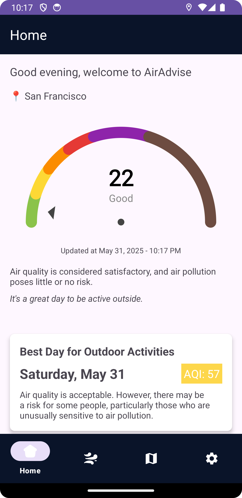
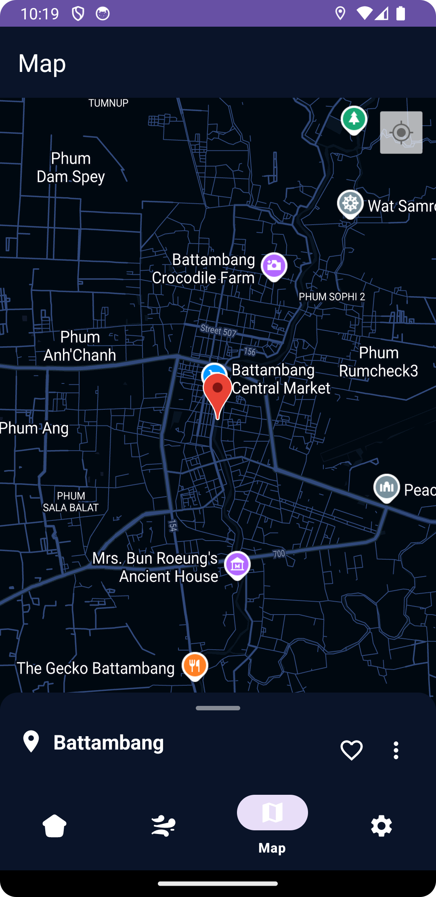
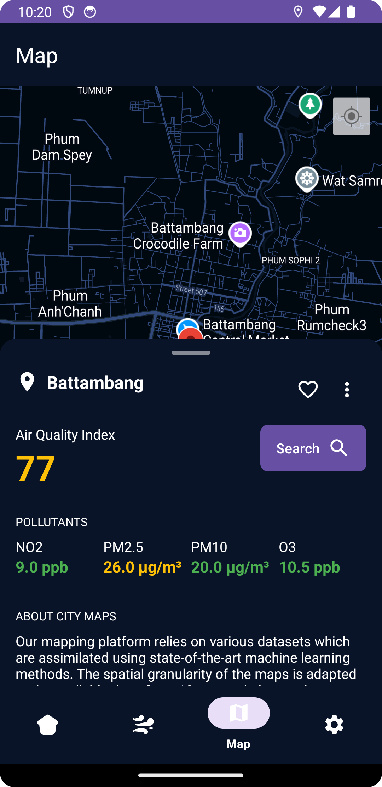
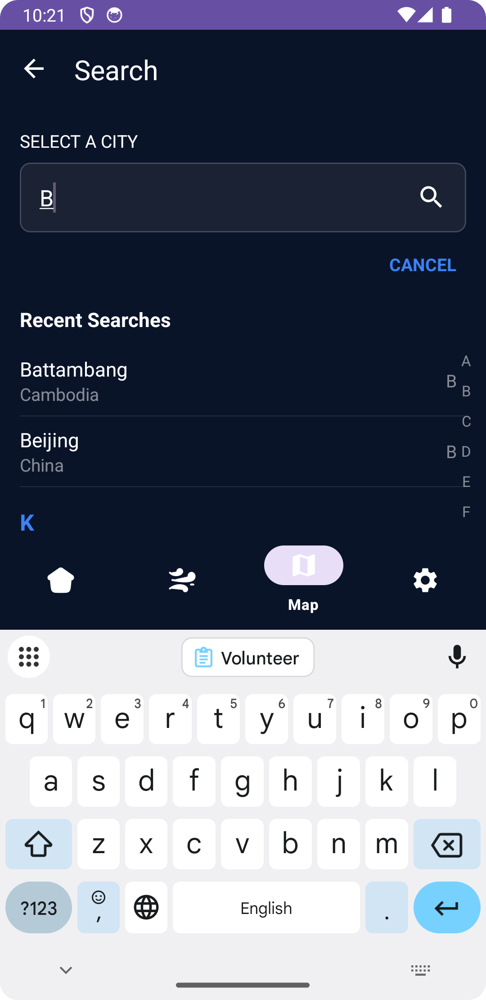
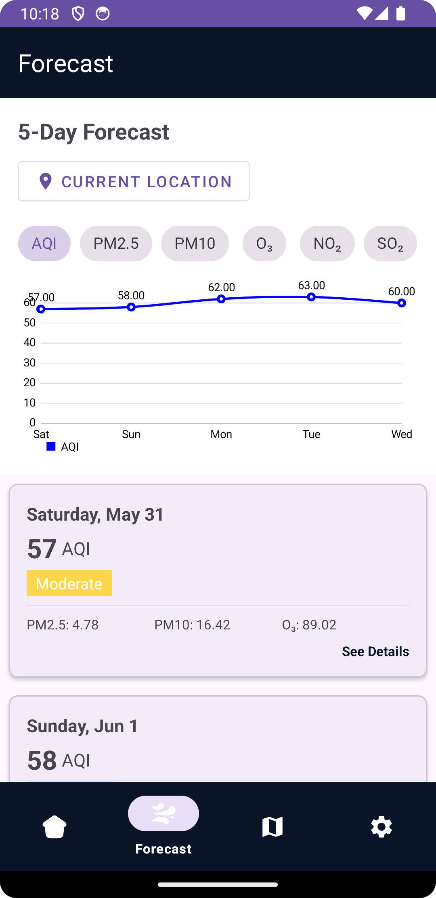
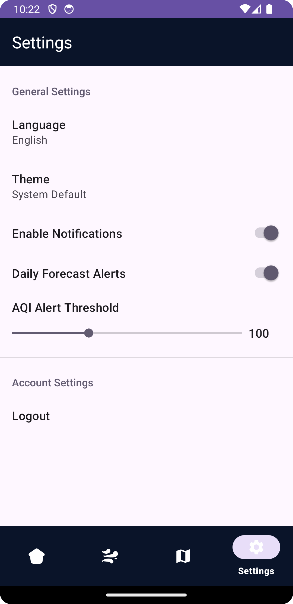

# AirAdvise 🌍💨  
*A real-time air quality monitoring app.*  

## Overview  
AirAdvise helps users make informed decisions about outdoor activities by providing real-time **AQI (Air Quality Index) data**, **forecasts**, and **health recommendations** based on air pollution levels.  

This project consists of:  
- **AirAdvise (Android App)** – A mobile application built with **Kotlin** for Android.  
- **[AirAdvise-API](https://github.com/Punvireakroth/AirAdvise-API)** – A Laravel-based backend that provides AQI data and other API services.  

## Screenshots

Here's a preview of AirAdvise in action:

### Home Screen


The home screen displays the current air quality index with a visual gauge, health implications, and the best day recommendation for outdoor activities.

### Map View


The map view shows air quality data geographically, allowing users to see pollution levels across different areas.

### City Air Quality Details


Detailed view of a city's air quality, showing the AQI value and specific pollutant measurements (NO2, PM2.5, PM10, O3).

### City Search


Users can search for cities to view their air quality data, with recent searches conveniently displayed.

### Forecast Screen


The forecast screen provides a 5-day prediction of air quality, helping users plan outdoor activities ahead of time.

### Settings


The settings screen allows users to customize their experience, including language preference, theme selection, and notification settings.

## Installation & Setup  
### 1. Clone the Repository  

```bash
git clone https://github.com/Punvireakroth/AirAdvise.git

cd AirAdvise
```

### 2. Set Up the Android Project

- Open the project in Android Studio
- Sync Gradle files
- Run the app on an emulator or physical device

### 3. Configure API Connection

The app retrieves data from the AirAdvise-API backend. To set up the API:
- Clone the backend repository:

```bash
git clone https://github.com/Punvireakroth/AirAdvise-API.git

cd AirAdvise-API
```

- Follow the setup instructions in **[AirAdvise-API](https://github.com/Punvireakroth/AirAdvise-API)** 


### License 📜

<!--  -->
This project is licensed under the GNU Affero General Public License v3.0 (AGPL-3.0) with the following additional terms:

- ✅ The source code is open for viewing, modification, and educational use
- ✅ Contributions to the project are welcome
- ❌ Commercial deployment of this codebase as a competing service is not permitted without prior written agreement
- ❌ The project name and branding are protected and require explicit permission for use

For business inquiries, commercial licensing, or any questions, please contact [vireakrothpun@gmail.com]

See the [LICENSE](LICENSE) file for the full AGPL-3.0 terms.